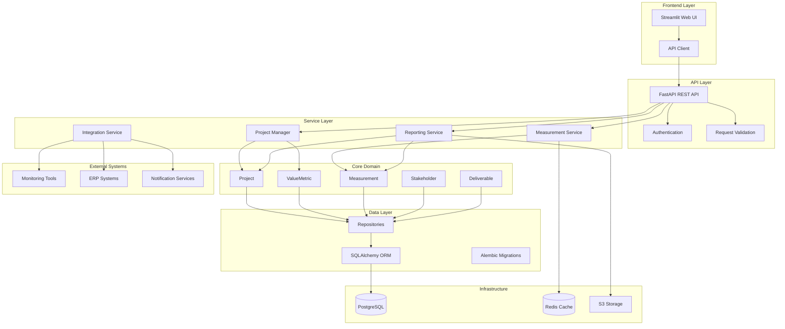
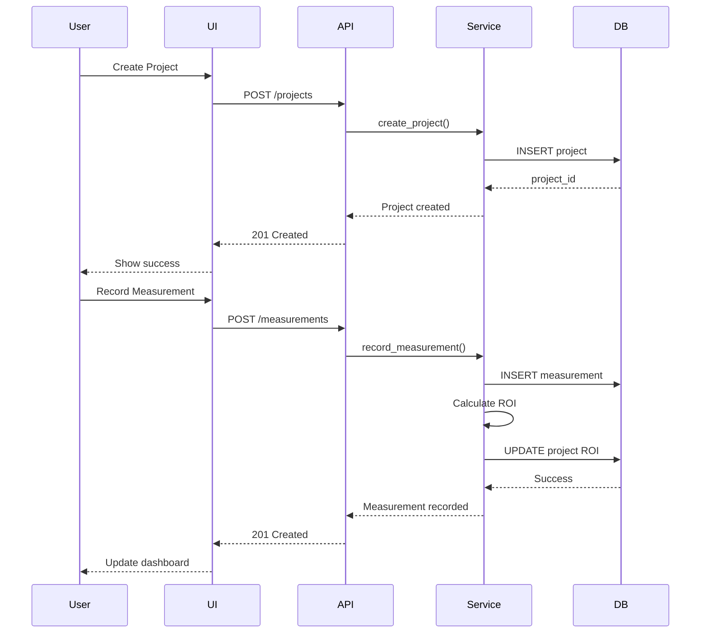
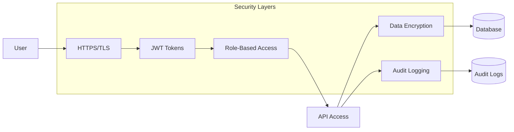
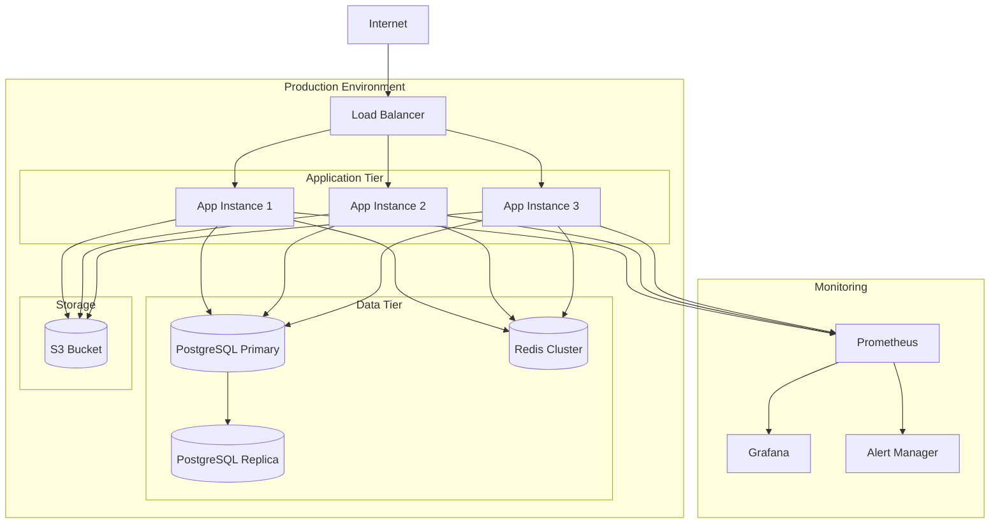

# System Architecture

## Overview

The Value-Based IT Project Management System follows a layered architecture pattern with clear separation of concerns.

## Architecture Diagram

## Component Details

### Frontend Layer
- **Streamlit Web UI**: Interactive dashboard for project management
- **API Client**: HTTP client for REST API communication

### API Layer
- **FastAPI**: High-performance REST API framework
- **Authentication**: JWT-based authentication and authorization
- **Validation**: Pydantic models for request/response validation

### Service Layer
- **Project Manager**: Orchestrates project operations
- **Measurement Service**: Handles metric data collection and storage
- **Reporting Service**: Generates dashboards and reports
- **Integration Service**: Manages external system connections

### Core Domain
- **Project**: Main aggregate root containing project data
- **ValueMetric**: Business value measurement definitions
- **Measurement**: Actual measurement data points
- **Stakeholder**: People interested in project value
- **Deliverable**: Project outputs with value mapping

### Data Layer
- **SQLAlchemy ORM**: Object-relational mapping
- **Repositories**: Data access abstraction
- **Alembic**: Database migration management

### Infrastructure
- **PostgreSQL**: Primary data store
- **Redis**: Caching for performance
- **S3**: File storage for reports and exports

## Data Flow

## Security Architecture

## Deployment Architecture

## Technology Stack

### Backend
- **Language**: Python 3.9+
- **Framework**: FastAPI
- **ORM**: SQLAlchemy
- **Database**: PostgreSQL
- **Cache**: Redis
- **Task Queue**: Celery (future)

### Frontend
- **Framework**: Streamlit
- **Charts**: Plotly
- **Styling**: Custom CSS

### Infrastructure
- **Container**: Docker
- **Orchestration**: Kubernetes (production)
- **CI/CD**: GitHub Actions
- **Monitoring**: Prometheus + Grafana

### Development Tools
- **Testing**: pytest
- **Linting**: flake8, black
- **Type Checking**: mypy
- **Documentation**: Sphinx