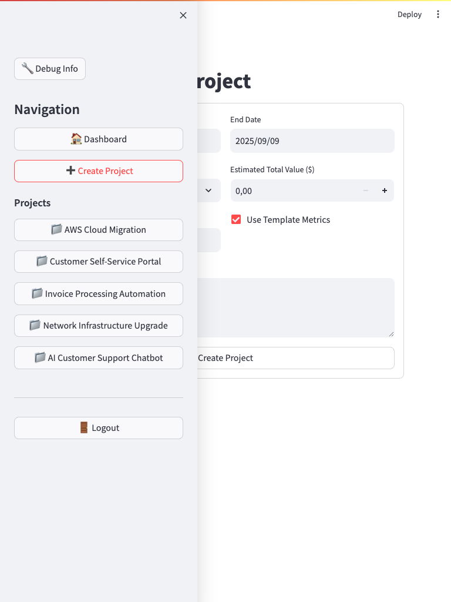

# ValuePM - UI Documentation

*Generated automatically on 2025-06-11 18:30:51*

## Overview

This documentation provides a visual walkthrough of ValuePM's user interface - a Value-Based Project Management System.

## Login & Authentication

### Login Page
The application requires authentication to access project data and features.

## Dashboard Overview

### Portfolio Dashboard
The main dashboard provides an overview of all projects, key metrics, and portfolio performance.

### Projects Table
Detailed table view of all projects with their current status and ROI.

## Project Management

### Project Detail View
Detailed view of individual projects showing metrics progress and recent measurements.

### Metrics Progress
Visual progress indicators for project value metrics.

### Create New Project
Form for creating new projects with template-based metric selection.

## Responsive Design

### Desktop View (1920x1080)

### Tablet View (768x1024)

### Mobile View (375x812)

## Features Demonstrated

### ✅ Completed Features
- User authentication and session management
- Portfolio overview with key metrics
- Project creation with template system
- Real-time ROI calculations
- Interactive charts and visualizations
- Measurement recording and tracking
- Responsive design for all devices

### 🚀 Key Capabilities
- **Value-Based Tracking**: Focus on business value rather than traditional project metrics
- **Template System**: Pre-configured metrics for Infrastructure, Software Development, and Digital Transformation projects
- **Real-time Dashboards**: Live updates of project progress and ROI
- **Interactive Charts**: Plotly-based visualizations for trend analysis
- **Measurement History**: Track value metrics over time with confidence levels

## Navigation

The application uses a sidebar navigation with the following sections:
- **Dashboard**: Portfolio overview and key metrics
- **Create Project**: Add new projects to the portfolio
- **Project List**: Quick access to individual project details
- **User Management**: Login/logout functionality

## Technical Implementation

- **Frontend**: Streamlit with custom styling
- **Charts**: Plotly for interactive visualizations
- **Authentication**: JWT-based session management
- **API Integration**: RESTful API calls to backend services
- **Responsive Design**: CSS Grid and Flexbox layouts

---

*This documentation is automatically generated as part of the CI/CD pipeline to ensure it stays current with the latest UI changes.*
